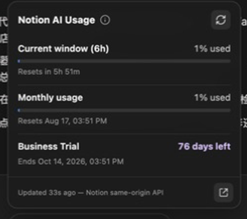
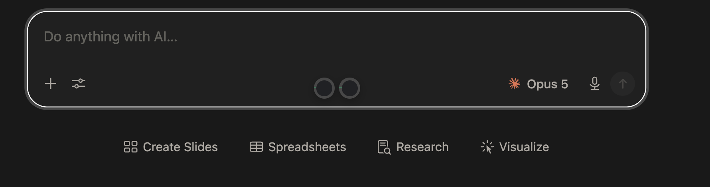

# [Notion AI] Usage [20260731] v1.1.2

当前发布版本：`[20260731] v1.1.2`。用户脚本的机器版本为 `20260731.1.1.2`，以符合 Violentmonkey 的版本比较格式。

在 Notion 页面显示 AI 的滚动用量、月度用量，以及当前工作区的正常订阅状态或 Business Trial 剩余时间；最小化后，双圆环会停靠在 Notion AI 输入框内部的底部中央。脚本使用 Notion 自己的同源接口和当前登录态，不读取、不保存、也不外传 Cookie、`token_v2` 或 Authorization。

Notion 官方目前把额度分成「滚动六小时窗口」和「月度窗口」；原生入口是 `Settings → Notion AI → Usage`。Business Plan 通用试用通常为 30 天，但活动期限并不固定，所以脚本只采用服务端返回的实际结束时间，不用固定天数倒推。参见 [AI 用量说明](https://www.notion.com/en-gb/help/manage-your-usage-allowance-for-notion-ai)与 [付费套餐试用说明](https://www.notion.com/en-gb/help/paid-plan-trials)。

## 截图






## 功能

- 可拖拽小胶囊，展开后显示当前会话、月度用量、百分比和重置时间；胶囊右侧常驻最小化按钮，无需先展开卡片。最小化后只保留代表 `6h` 与 `Monthly` 的两个紧凑圆环，并自动停靠在 Notion AI 输入框内部的底部中央；默认不显示圆内百分比和底部文案，悬停或键盘聚焦时才显示两个百分比，点击即可恢复。胶囊与展开卡片标题栏可拖动，位置会以视口边缘锚点保存在当前 Notion 网页的 `localStorage`；停靠坐标只由输入框实时计算，不会覆盖保存位置，恢复后仍回到原处。靠近窗口底部时，卡片会自动向上展开。
- 正常付费工作区显示套餐与订阅状态，例如 `Business · Active`；展开后显示当前账单周期结束时间。
- 若当前工作区处于 Business Trial，额外显示 `剩余 N 天` 与精确结束日期；兼容独立 trial 与 subscription-backed trial。
- 将未订阅、未知套餐或订阅状态与尚未加载区分显示，不把未知值猜成 Free 或有效订阅。
- 自动跟随 Notion UI 语言：`zh-*` 使用中文，其余语言使用英文。
- 自动跟随 Notion 自身的普通/黑暗主题，并在页面内切换主题时实时更新。
- 状态点、首段用量和分隔符之间采用更宽松的间距；胶囊直接从用量百分比开始，不再重复显示 `AI`；用量百分比之间保留圆点，套餐或 Trial 前使用 1 px 竖线；刷新和原生用量页入口均使用带无障碍标签的 SVG 图标按钮。
- 刷新图标按 [Lucide `refresh-cw`](https://lucide.dev/icons/refresh-cw) 的官方 24 px 路径重绘。
- `preview` 说明收进标题右侧的信息图标，鼠标悬停或键盘聚焦时显示。
- 支持 `within_limit`、`rate_limited`、`not_applicable` 三种状态。
- 用量常规主动轮询约每 60 秒；账单与试用数据最多每小时读取一次；页面隐藏时暂停，错误时退避。
- 首次加载会先给 Notion 原生用量请求 1 秒响应时间；若其仍未完成，脚本立即用同源接口主动兜底，不再等待十几秒。
- AI 请求结束后延迟刷新，并在当前页面内保留最后一次有效数据。
- 点击卡片底部的外链图标可打开 Notion 的 `Settings → Notion AI → Usage`。
- Shadow DOM 隔离样式，不依赖 Notion 的混淆 class，也不挂进 React 子树。
- 兼容 Notion SPA；宿主被页面移除后会自动恢复。
- 支持 Tabbit/ChatClub 等跨源容器中的 Notion iframe；若存在 Notion 祖先 frame，只在最外层 Notion 文档显示一份。

## 安装

### Violentmonkey

1. 在目标浏览器安装 Violentmonkey。
2. [直接安装用户脚本](https://raw.githubusercontent.com/0-V-linuxdo/notion-ai-usage/main/notion-ai-usage.user.js)，或新建用户脚本并粘贴 [notion-ai-usage.user.js](./notion-ai-usage.user.js) 的全部内容。
3. 打开或刷新 `https://app.notion.com/ai`。

### AdGuard 桌面版

1. 打开 AdGuard for Mac/Windows 的「设置 → 扩展」。
2. 选择「添加扩展」，再从文件或 URL 导入 [notion-ai-usage.user.js](./notion-ai-usage.user.js)。
3. 启用脚本后，完全刷新已打开的 Notion 页面。

脚本使用 AdGuard 官方支持的 `@grant unsafeWindow` 进入页面上下文，并通过 `ADG_policyApi` 兼容 Trusted Types；同时保留 Violentmonkey 的 `@inject-into page`，防止其回退到无法观察 Notion 网络请求的隔离世界。`@inject-into` 只供 Violentmonkey 使用，AdGuard 的页面上下文由 `unsafeWindow` 提供，并不依赖该字段。同一份脚本可由 AdGuard 桌面版跨浏览器注入，也可直接安装到 Violentmonkey。页面右上角出现 `…% · …% | Business · Active` 或 `…% · …% | Trial …d`（中文界面显示中文）胶囊后即表示运行成功。

若 AdGuard 2.19+ 在导入时提示脚本会修改站点安全相关 API，这是因为本脚本需要在页面内观察 `fetch`/XHR 才能读取 Notion 自己返回的用量；请只安装你已检查过的本地文件。若脚本未出现，请确认 Notion 没有被加入 AdGuard 例外列表，并在启用扩展后完全刷新页面。

目标浏览器：Arc、Zen、Firefox Nightly、Dia、Tabbit。浏览器必须允许安装兼容扩展；本项目不提供 `javascript:` bookmarklet。

当 Notion 被嵌入 Tabbit 一类的跨源容器时，脚本仍只匹配并运行在 `app.notion.com` frame 内，不会注入容器顶层，也不会读取或操作父页面。

位置存储采用一个稳定的 v2 边缘锚点键：保存普通胶囊距离 Notion 文档视口最近边缘的 CSS 像素距离，而不是某次 iframe 尺寸下的绝对 `left/top`，也不使用会在 iframe 重建时变化的 frame binding。窗口缩放、iframe 宽度变化、展开/收起和状态文案变宽只会重算显示坐标，不会把临时 clamp 后的位置写回；最小化时的输入框停靠位置则完全根据当前 composer 外框派生，同样绝不写入位置键。旧 v1 绝对坐标与早期 frame-scoped v2 键均只读兼容；用户下一次真实拖拽普通胶囊或卡片标题栏后，只写稳定键 `notion-ai-usage:position:v2`。该键属于当前 Notion origin 及浏览器存储分区，因此不同浏览器配置文件不会互相共享位置。

## 它怎样取数

当前 Notion 原生 Usage 页的数据源是：

```text
POST /api/v3/getCreditRateLimitStatus
Content-Type: application/json

{"spaceId":"当前工作区 UUID"}
```

脚本在 `document-start` 观察页面自身的 `fetch` 和 XHR：

1. 精确匹配同源的 `getCreditRateLimitStatus` 与旧版 `getAIUsageEligibility`。
2. 从页面请求中取得当前 `spaceId` 和必要的非密钥请求头；同一工作区与用户的稀疏请求不会覆盖已经取得的完整请求配方。
3. 使用 `response.clone()` 异步读取响应，不消费、阻塞或替换 Notion 的原响应。
4. 主动刷新只调用新版 `getCreditRateLimitStatus`；旧接口只用于 workspace 上下文和兼容回退。
5. 同源请求使用浏览器自动携带的现有登录态；代码从不访问 Cookie 内容。

响应中真正用于显示的核心结构为：

```js
{
  status: "within_limit" | "rate_limited" | "not_applicable",
  window: {
    window: "6h" | "24h",
    used: Number,
    limit: Number
  },
  resetsInSeconds: Number,
  billingPeriodWindow: {
    used: Number,
    limit: Number,
    periodEndMs: Number
  }
}
```

百分比为 `clamp(used / limit * 100, 0, 100)`。月度窗口已经结束时不会继续显示旧数据。

套餐订阅与 Business Trial 使用另一个只读 workspace 接口：

```text
POST /api/v3/getBillingData
Content-Type: application/json

{"spaceId":"当前工作区 UUID"}
```

正常订阅使用的最小字段为：

```text
billingData.subscription.status
billingData.subscription.currentPeriodEnd
billingData.subscription.items[].price.product
```

Business Trial 的实际日期路径为：

```text
billingData.trial.startDate
billingData.trial.endDate

或：

billingData.subscription.startDate
billingData.subscription.trialEnd
```

日期是带时区的 ISO-8601 字符串。正常订阅会显示服务端明确返回的状态与当前周期结束时间；状态不在允许列表内时显示“状态未知”，不会猜成 Active。

试用天数遵循 Notion 前端对 `billingData.clock` 的处理，并用其同款口径计算：从 billing 当前日期的零点到 trial end 的 UTC 天数差向上取整。独立 trial 只采用 `trial.items`，subscription-backed trial 只采用 `subscription.items`；两个 trial 表示同时出现或日期不合法时保留上一次有效状态。试用结束时会触发下一次账单刷新，随后回退到正常订阅状态。

## DevTools 验证

遵循项目约束，使用 DevTools，不使用 bookmarklet 或 `osascript`：

1. 在 Arc 打开 Notion AI。
2. 打开 DevTools → Network → Fetch/XHR。
3. 过滤 `getCreditRateLimitStatus` 或 `getBillingData`。
4. 点击脚本卡片中的「刷新」。
5. 应看到同源 POST，Request Payload 只有 `spaceId`；用量响应包含 `status`、`window`，账单响应包含最小投影所需的 `subscription` 或 `trial` 字段。
6. Console 不应出现脚本异常；接口 schema 改变时只会出现带 `[Notion AI Usage]` 前缀的警告，并继续保留最后有效快照。

旧接口 `getAIUsageEligibility` 也可能出现，但不能把旧 eligibility 字段误当成新 Usage 页的两条进度。

## 隐私与安全

- 无 `@connect`，无第三方请求，无遥测。
- 请求 URL 必须与当前 Notion 页面同源，且 pathname 必须精确匹配白名单。
- 仅在内存中复用 `content-type`、Notion client version、active user、space id 等允许项。
- 明确拒绝复制 `Cookie`、`Authorization` 和其他请求头。
- 用量快照只保存在当前页面内存中，不写入 Web Storage；网页自身的 `localStorage` 只保存卡片展开/收起、最小化偏好，以及用户真实拖拽后生成的稳定 v2 边缘锚点。
- `getBillingData` 还可能包含地址、支付方式与发票等账单字段；脚本设置 2 MB 上限，解析后立即只保留套餐、订阅状态、账单周期结束时间、trial 起止时间、服务端时钟和 `autoConvert`，其余字段与 `dependencies` 均不记录、不展示、不持久化。
- 401/403 时停止主动取数并提示权限问题，不尝试绕过认证。

## 开发与测试

无需安装依赖，Node.js 20 及以上即可：

```bash
npm run check
```

该命令先做 JavaScript 语法检查，再运行单元测试，覆盖当前 quota schema、正常与未知套餐订阅、两种 Business Trial schema、未知订阅状态、账单错误提示、Notion billing clock 天数算法、拖拽阈值与可视区域边界、输入框底部居中停靠几何、Arc/Tabbit 视口切换、稳定单键位置恢复、旧 scoped v2 与 v1 只读兼容、双圆环进度、畸形与过期日期、同源白名单、请求头脱敏、跨账号与并发响应竞态，以及非目标请求正文绝不被读取。

## 研究说明

Voyager 的 Gemini 实现与本脚本迁移取舍见 [docs/voyager-and-notion-analysis.md](./docs/voyager-and-notion-analysis.md)。本项目借鉴其「早期观察 → 结构校验 → 同源重放 → 缓存与 UI」架构，代码为独立实现，没有复制 Voyager 的 GPL 源码。
